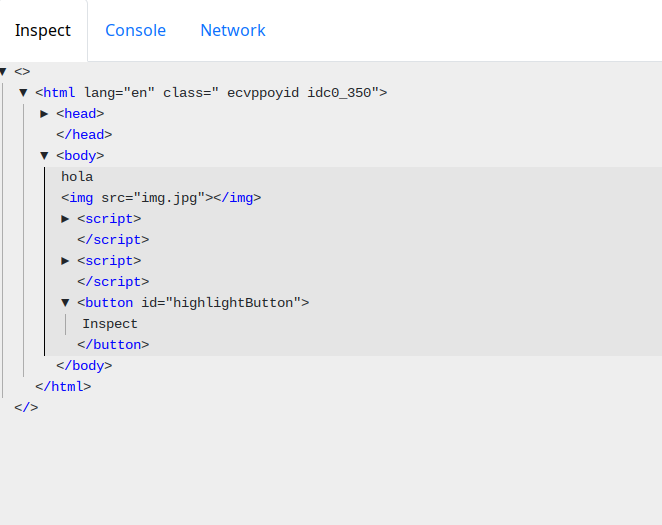
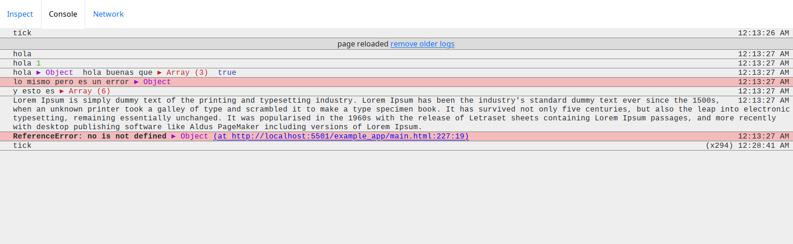
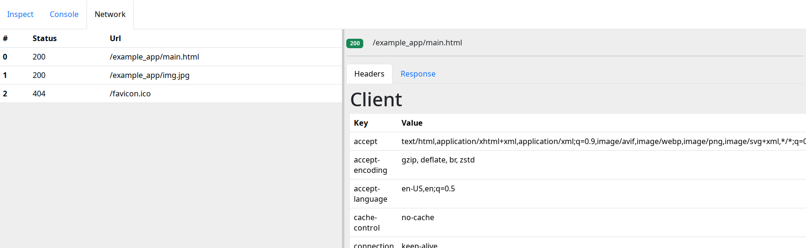

# Proxy Dev Tools

## Whats this tool about?

This tool solves a problem I found programing inside the Meta Quest 3. The built in browser has no dev tools aviable. which would be very useful while debuging WebXR experiencies. My tool proxys your project (which means that acts as a HTTP middle man), injecting a small code snippet in the web page that will allow you to access some basic debugging functionality. The debuging interface is hosted on another web page, wich makes it posible to use wherever you can access your original page.

## Features
- **Page HTML inspector**: The HTML code will be displayed and updated in real time. A floating button will appear in the client web page that allows you to select sections. Those sections will be highlighted aswell in the devtool inspector.

- **Browser Console sniffing**: see the messages caused by `console.log`, `console.err` and `window.onerror`.

- **Network sniffing**: The proxy will inform of the activity going though it (headers and body).


## Running app in dev mode

Run `npm i` in app/ and frontend_src/ before the first run.

```bash
cd app
deno run -A main.ts 
```

## Building from source

> Not working, deno doesn't like compiling when node:ws is a dependency.

As in dev mode, run `npm i` in app/ and frontend_src/ before the first run.

```bash
cd frontend_src
npm run build
```
Before going to the next step go to app/frontend.ts file and change line 5 to enter production mode. change to `if (true) {`
```bash
cd ../app
deno compile main.ts 
```

## Contributing
Yes please, drop a PR on this repo or mail me at jaimegonzalezfabregas@gmail.com. 